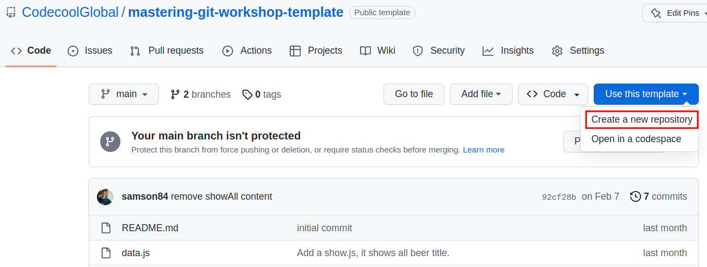
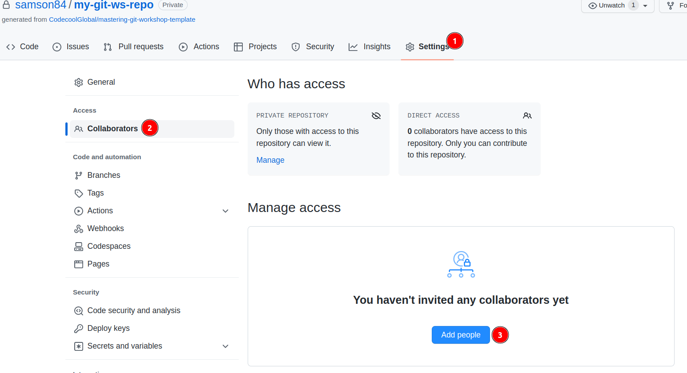

# Mastering GIT Workshop

Do the following steps to prepare the working environment
for the workshop. You will be working in pairs, so one repo/
2 sudents are enough.

## Create a new repo from the template

1. Select **Use this template**.
2. Select **Create a new repository**.

1. Select your Github account for the Owner.
2. You can name the repository as you want, it will be created with this name in your account.
3. You can choose public or private repo. I would recommend private, because it is not a project just an exercise, maybe you don't want to everybody see it.
4. You can keep include all branches unchecked.
5. Click on the create repository

## Invite your peer to your new repo

Navigate to your newly created repo in your Github account.

1. Click to repo **Settings** tab.
2. Click to **Collaborators** on the sidebar.
3. Use the **Add people** button to add your peer as a collaborator to your repo.

## Clone the repository as usual

1. Clone you and your peer the repo as usual.

## Install the Git Graph VS Code extension

1. Click on the Extensions pane in VS Code
2. Search for "Git Graph" [VS Code Marketplace: Git Graph](https://marketplace.visualstudio.com/items?itemName=mhutchie.git-graph)
3. Install and Enable it.